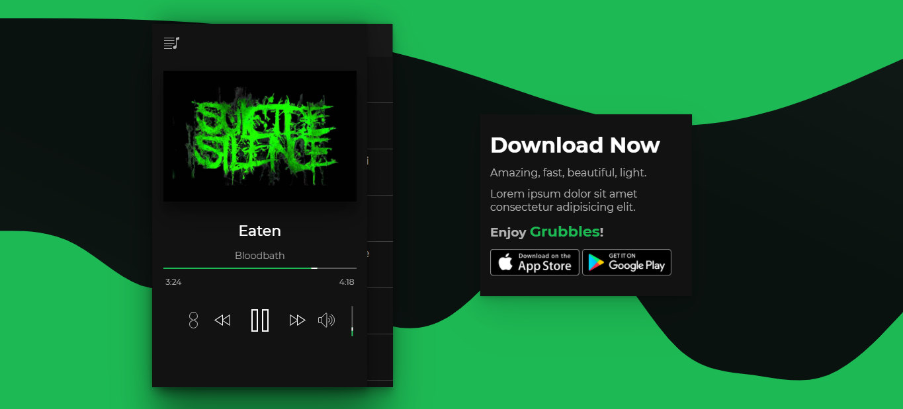

# Grubbles

## Music Player with ReactJS

> #### by guilhermevialle

## Features

-   Cool design
-   Lite
-   Reactive
-   Select musics
-   Add your musics - _working yet..._

### Preview

-   #### Usage

    

-   #### Page

    

-   #### Player interface and controls

    

-   #### You can slide for as long as you want

    

-   #### The song that is playing has a mark as shown in the image

    

-   #### Download the App on store

    

    ### About copy

-   #### All copyrights reserved

    ### Social Media

-   https://twitter.com/guivialle
-   https://www.instagram.com/guilherme.vialle/
